<!doctype html>
<html lang="id">
<head>
  <meta charset="utf-8">
  <meta name="viewport" content="width=device-width, initial-scale=1">
  <meta name="theme-color" content="#111512">
  <meta name="description" content="Portofolio Yusuf: pengembangan aplikasi web dan mobile, dashboard, serta sistem informasi. Jelajahi 11 proyek dan unduh portofolio PDF.">
  <title>Yusuf — Web &amp; Mobile Portfolio</title>
  <link rel="icon" type="image/svg+xml" href="data:image/svg+xml,%3Csvg xmlns='http://www.w3.org/2000/svg' viewBox='0 0 32 32'%3E%3Crect width='32' height='32' rx='8' fill='%23c5f475'/%3E%3Cpath d='M8 7l8 11 8-11M16 18v8' fill='none' stroke='%23111512' stroke-width='4'/%3E%3C/svg%3E">
  <link rel="stylesheet" href="style.css">
</head>
<body>
  <a class="skip" href="#main">Lewati ke konten</a>
  <header class="header wrap">
    <a class="brand" href="#" aria-label="Yusuf, beranda">Y. Yusuf / PORTFOLIO</a>
    <nav aria-label="Navigasi utama"><a href="#work">Proyek</a><a href="#portfolio">Portofolio PDF ↗</a></nav>
  </header>
  <main id="main">
    <section class="hero wrap" aria-labelledby="hero-title">
      

WEB &amp; MOBILE DEVELOPMENT

        <h1 id="hero-title">Dari ide. Menjadi <em>aplikasi.</em></h1>
        
Saya Yusuf. Berikut kumpulan proyek web dan mobile—mulai dari landing page, dashboard, hingga sistem informasi.

        
<a class="button primary" href="#work">Jelajahi proyek ↓</a><a class="text-link" href="assets/Yusuf-Portfolio.pdf" download>Unduh PDF ↘</a>

        
11 proyekWeb &amp; mobileFrontend &amp; backend

      

      <a class="hero-feature" href="#project-1" aria-label="Jelajahi proyek Mythic Protocol">
        
PROJECT SPOTLIGHT01 / 11

        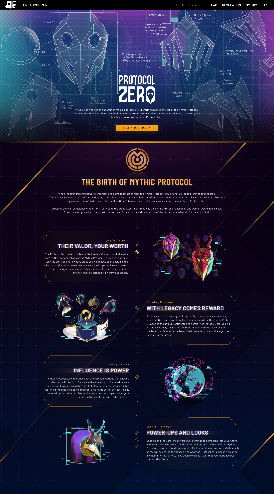
        

LANDING PAGE
<h2>Mythic Protocol</h2>
↗

      </a>
    </section>
    <section class="work wrap" id="work" aria-labelledby="work-title">
      

PORTOFOLIO PROYEK
<h2 id="work-title">Karya &amp; implementasi.</h2>

11 proyek / Web &amp; Mobile

      
<article class="project" id="project-1">
      <a class="project-image" href="assets/Yusuf-Portfolio.pdf#page=1" target="_blank" rel="noopener" aria-label="Lihat Mythic Protocol di PDF, tab baru">
        
        Lihat di PDF ↗
      </a>
      

Landing page01

      <h3>Mythic Protocol</h3>
Landing page untuk game Mythic Protocol.

C#ReactJS

    </article>
<article class="project" id="project-2">
      <a class="project-image" href="assets/Yusuf-Portfolio.pdf#page=2" target="_blank" rel="noopener" aria-label="Lihat Customer Relationship Management di PDF, tab baru">
        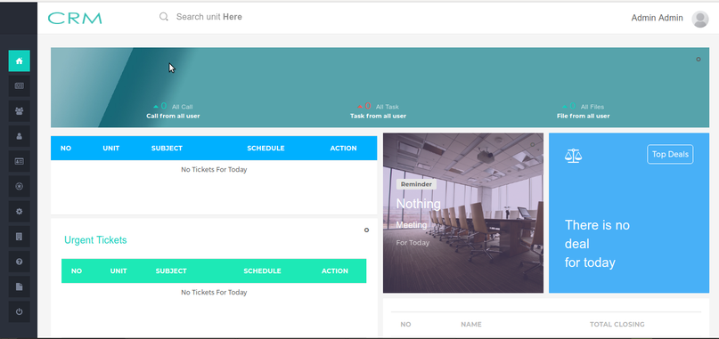
        Lihat di PDF ↗
      </a>
      

Business application02

      <h3>Customer Relationship Management</h3>
Aplikasi untuk mengelola interaksi perusahaan dengan pelanggan dan calon pelanggan.

Laravel 5.4MySQL

    </article>
<article class="project" id="project-3">
      <a class="project-image" href="assets/Yusuf-Portfolio.pdf#page=3" target="_blank" rel="noopener" aria-label="Lihat Roto-Rooter di PDF, tab baru">
        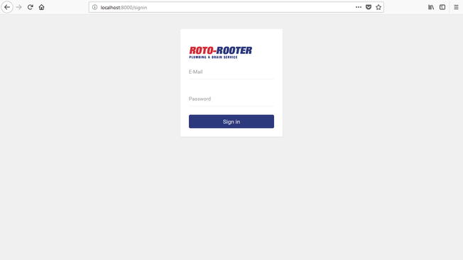
        Lihat di PDF ↗
      </a>
      

Company dashboard03

      <h3>Roto-Rooter</h3>
Dashboard pengelolaan company profile Roto-Rooter.

Laravel 5.4MySQL

    </article>
<article class="project" id="project-4">
      <a class="project-image" href="assets/Yusuf-Portfolio.pdf#page=4" target="_blank" rel="noopener" aria-label="Lihat e-SILAKU di PDF, tab baru">
        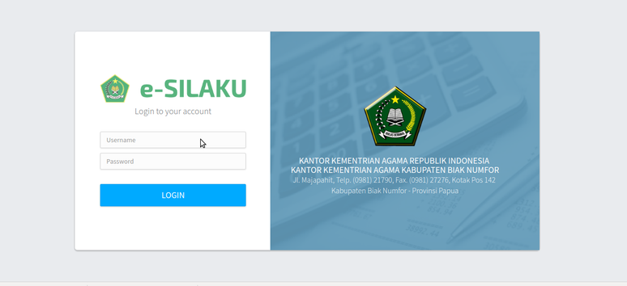
        Lihat di PDF ↗
      </a>
      

Financial information system04

      <h3>e-SILAKU</h3>
Sistem Informasi Layanan Keuangan Terpadu yang mendukung tata kelola, pelaksanaan SOP, e-Government, dan akuntabilitas kinerja keuangan.

Laravel 5.4MySQL

    </article>
<article class="project" id="project-5">
      <a class="project-image" href="assets/Yusuf-Portfolio.pdf#page=5" target="_blank" rel="noopener" aria-label="Lihat IRSMS Korlantas Polri di PDF, tab baru">
        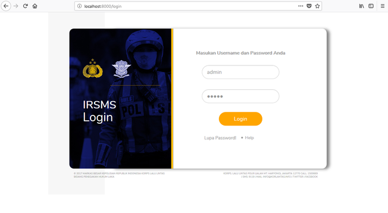
        Lihat di PDF ↗
      </a>
      

Road safety management05

      <h3>IRSMS Korlantas Polri</h3>
Integrated Road Safety Management System untuk pendataan kecelakaan lalu lintas.

Laravel 5.4PostgreSQL

    </article>
<article class="project" id="project-6">
      <a class="project-image" href="assets/Yusuf-Portfolio.pdf#page=6" target="_blank" rel="noopener" aria-label="Lihat Hoobex – Travel di PDF, tab baru">
        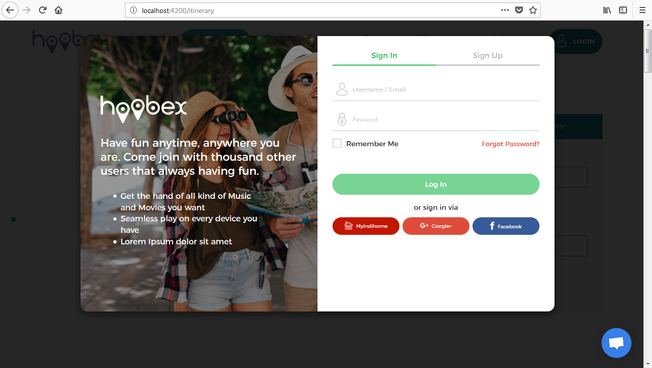
        Lihat di PDF ↗
      </a>
      

Travel social platform06

      <h3>Hoobex – Travel</h3>
Aplikasi media sosial untuk traveler.

Laravel 5.4Angular 4MongoDB

    </article>
<article class="project" id="project-7">
      <a class="project-image" href="assets/Yusuf-Portfolio.pdf#page=7" target="_blank" rel="noopener" aria-label="Lihat Djurnee di PDF, tab baru">
        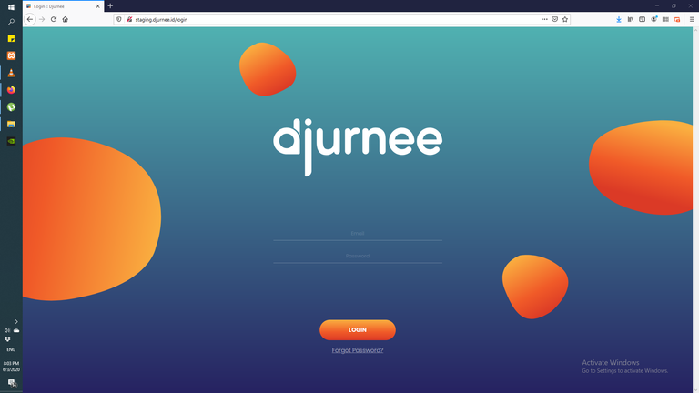
        Lihat di PDF ↗
      </a>
      

Travel application07

      <h3>Djurnee</h3>
Aplikasi untuk penugasan perjalanan bagi traveler.

Laravel 5.4ReactJSPostgreSQL

    </article>
<article class="project" id="project-8">
      <a class="project-image" href="assets/Yusuf-Portfolio.pdf#page=8" target="_blank" rel="noopener" aria-label="Lihat FITA di PDF, tab baru">
        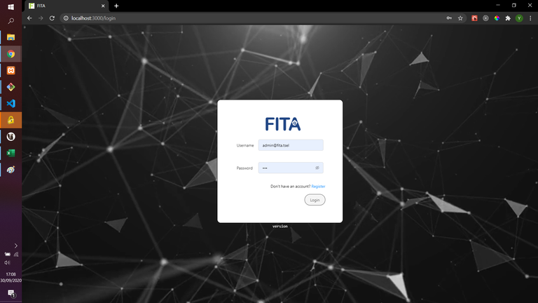
        Lihat di PDF ↗
      </a>
      

Admin dashboard08

      <h3>FITA</h3>
Dashboard administrasi untuk pengelolaan daftar data tower.

KoaReactJSPostgreSQL

    </article>
<article class="project" id="project-9">
      <a class="project-image" href="assets/Yusuf-Portfolio.pdf#page=9" target="_blank" rel="noopener" aria-label="Lihat Wiratamaniaga di PDF, tab baru">
        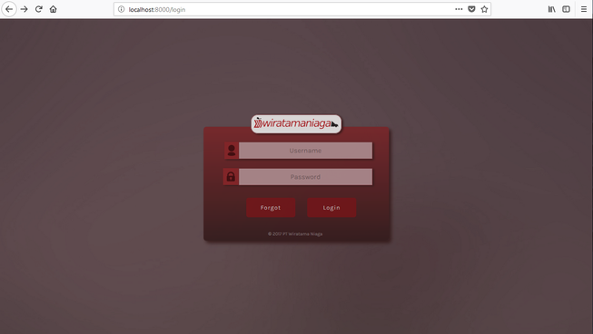
        Lihat di PDF ↗
      </a>
      

Inventory application09

      <h3>Wiratamaniaga</h3>
Aplikasi untuk pencatatan barang masuk dan barang keluar.

Laravel 5.4PostgreSQL

    </article>
<article class="project" id="project-10">
      <a class="project-image" href="assets/Yusuf-Portfolio.pdf#page=10" target="_blank" rel="noopener" aria-label="Lihat Pucutoon di PDF, tab baru">
        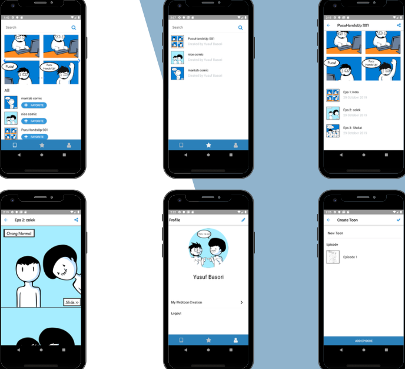
        Lihat di PDF ↗
      </a>
      

Mobile application10

      <h3>Pucutoon</h3>
Aplikasi mobile untuk berbagi komik orisinal, terinspirasi dari Webtoon. Dikembangkan dalam tiga minggu.

React NativeExpressJSPostgreSQL

    </article>
<article class="project" id="project-11">
      <a class="project-image" href="assets/Yusuf-Portfolio.pdf#page=11" target="_blank" rel="noopener" aria-label="Lihat Waterfall Room di PDF, tab baru">
        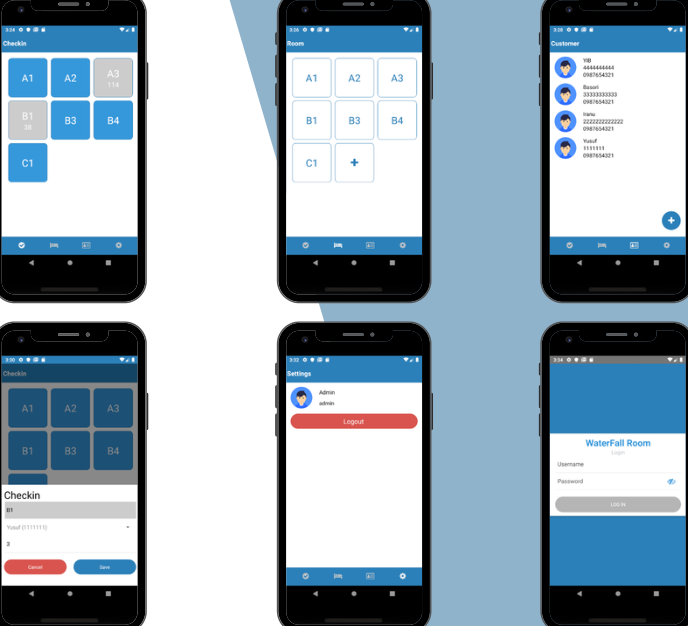
        Lihat di PDF ↗
      </a>
      

Mobile application11

      <h3>Waterfall Room</h3>
Aplikasi mobile bagi administrator untuk mengelola ruangan dan pelanggan. Dikembangkan dalam lima hari.

React NativeExpressJSPostgreSQL

    </article>

    </section>
    <section class="pdf-section wrap" id="portfolio" aria-labelledby="pdf-title">
      

PORTOFOLIO LENGKAP
<h2 id="pdf-title">Semua proyek. Satu dokumen.</h2>
Lihat screenshot dan detail teknologi pada dokumen portofolio asli.

      
<a class="button dark" href="assets/Yusuf-Portfolio.pdf" target="_blank" rel="noopener">Lihat PDF ↗</a><a class="download-link" href="assets/Yusuf-Portfolio.pdf" download>Unduh portofolio ↓</a>PDF · 11 halaman · 4,1 MB

    </section>
  </main>
  <footer class="footer wrap"><a class="brand" href="#">Yusuf / PORTFOLIO</a><a href="#">Kembali ke atas ↑</a></footer>
</body>
</html>
